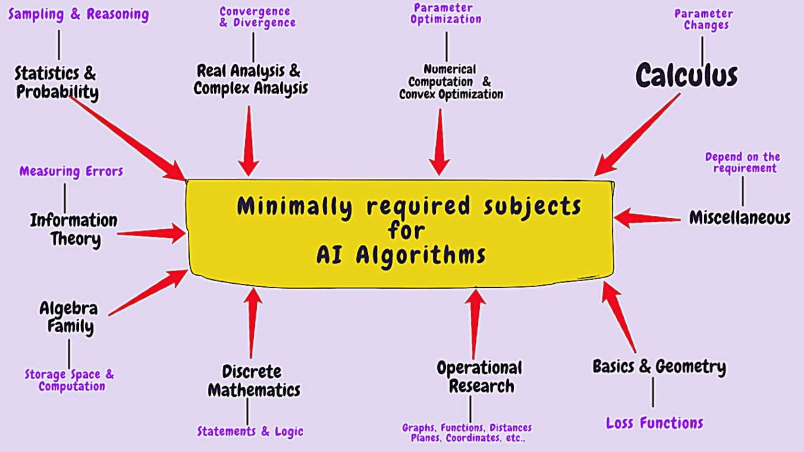
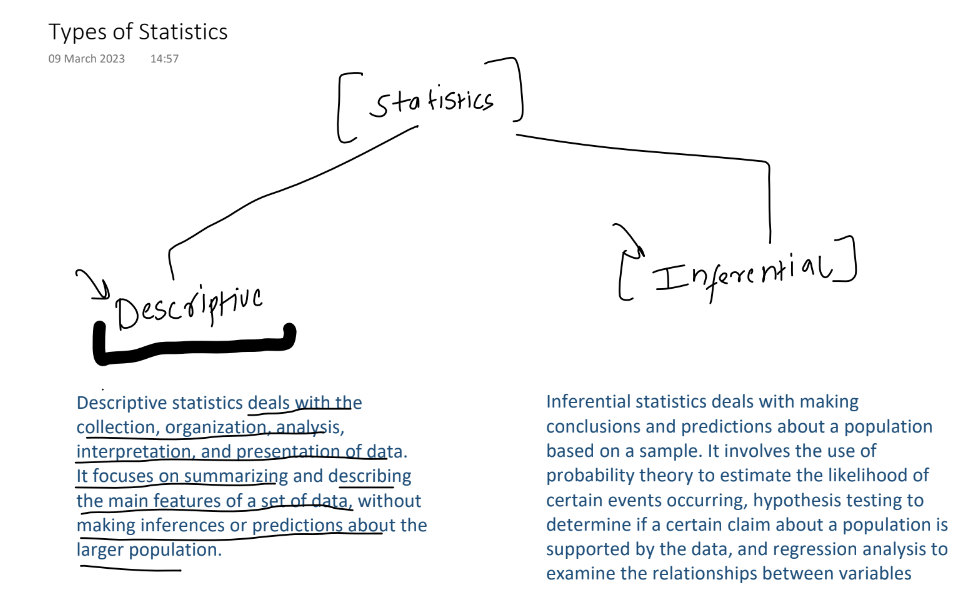
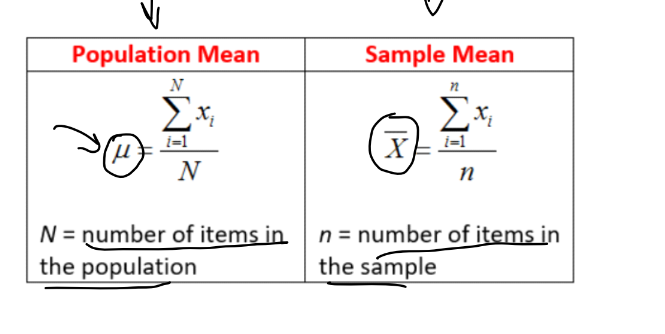
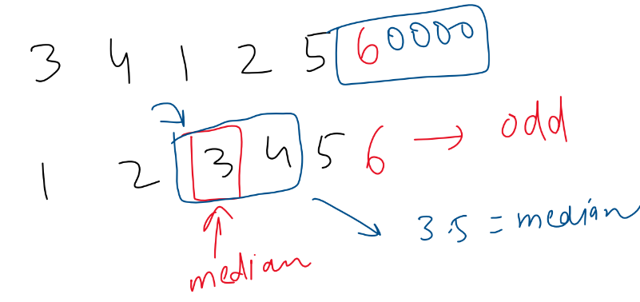
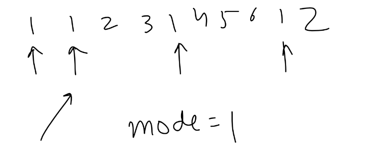
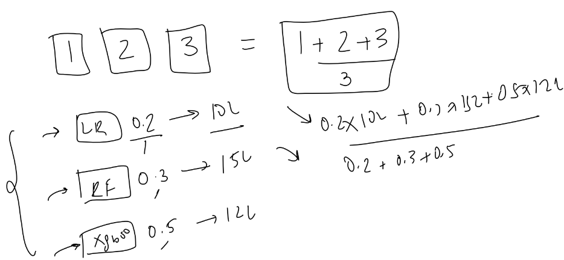

# ML-Mathmatices

<!--  -->

Linear Algebra and analysis
----------------------------
Linear algebra is the branch of mathematics concerning linear equations such as:
a1x1+⋯+anxn=b,linear maps such as:(x1,…,xn)↦a1x1+⋯+anxn, and their representations in vector spaces and through matrices

<<<<<<< HEAD

=======

>>>>>>> e3f37994ac20c600598be7543329c614e64ad8ac

 
# Statistics
Statistics is a branch of mathematics that involves collecting,
analysing, interpreting, and presenting data. It provides tools and
methods to understand and make sense of large amounts of data
and to draw conclusions and make decisions based on the data.
In practice, statistics is used in a wide range of fields, such as
business, economics, social sciences, medicine, and engineering. It is
used to conduct research studies, analyse market trends, evaluate
the effectiveness of treatments and interventions, and make
forecasts and predictions.

## Types of statistics

## Measure of Central Tendency
A measure of central tendency is a statistical measure that represents a typical orcentral value for a dataset. It provides a summary of the data by identifying a
single value that is most representative of the dataset as a whole.

## Mean
Mean: The mean is the sum of all values in the dataset divided by the number of
values.

## Median
Median: The median is the middle value in the dataset when the data is arranged
in order.

## Mode
Mode: The mode is the value that appears most frequently in the dataset..

## Weighted Mean
Weighted Mean: The weighted mean is the sum of the products of each value and
its weight, divided by the sum of the weights. It is used to calculate a mean when
the values in the dataset have different importance or frequency.

